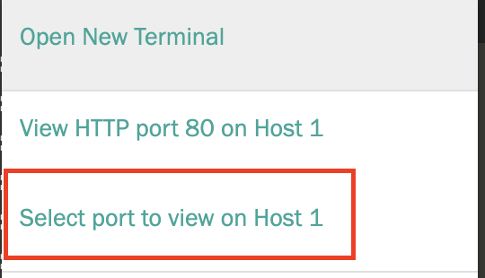
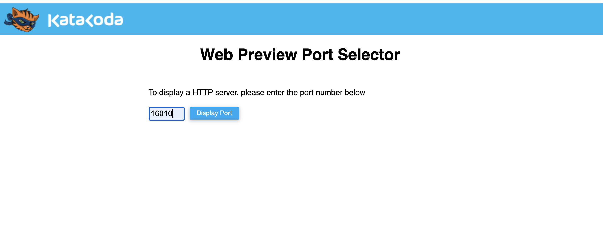

This is your first step.

## Task

This is an _example_ of creating a scenario and running a **command**

`docker pull apachekylin/apache-kylin-standalone:3.1.0`{{execute}}

`docker run -d \
-m 8G \
-p 7070:7070 \
-p 8088:8088 \
-p 50070:50070 \
-p 8032:8032 \
-p 8042:8042 \
-p 16010:16010 \
apachekylin/apache-kylin-standalone:3.1.0`{{execute}}

Click on the plus sign to the right of 'Terminal' 

Then, click **Select Port to view on Host 1**

Type in 16010 into the dialog box to view the HBase page, which shows you xyz

