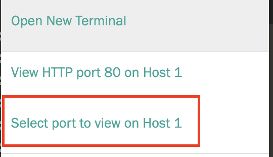

Open UI 

## Task 

Click on the plus sign to the right of 'Terminal' 

Then, click **Select Port to view on Host 1**

Type in 16010 into the dialog box to view the HBase page, which shows you xyz

Do this again but this time type in 7070 to view Kylin 

Use username and password ADMIN/KYLIN to get through 

